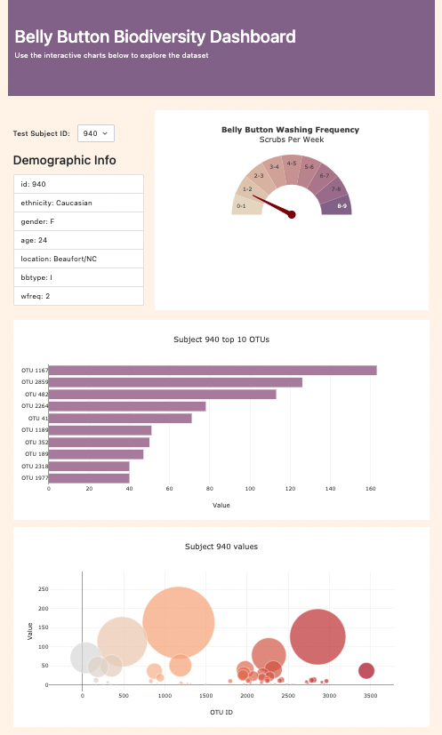

# Plotly Challenge

## Overview

For this project, the goal is to build a data visualization dashboard for a [dataset](http://robdunnlab.com/projects/belly-button-biodiversity) of microbes found in the navels of 153 human subjects. The basic requirements are:

- Static HTML/CSS/JS page with some simple Bootstrap styling
- D3 for DOM traversal/manipulation and extracting data from static JSON file
- Plotly to build bar and bubble charts for a single subject
- Display a list of demographic information about the subject
- Dropdown menu to allow user to select a subject, then rebuild the charts and list
- Deploy to some sort of web hosting service, such as Github Pages 

There is also a bonus challenge to build a gauge chart (although technically it's not a gauge chart, which I'll go into later).

You can check out the [finished product](https://sjwyates.github.io/plotly-challenge) on Github Pages. Here's a preview:



## Dataset

There are 3 main parts to the dataset. The first is `samples`, which contains the measurement data for each subject:

```
{
  "id": "940",
  "otu_ids": [
    1167,
    ...
  ],
  "sample_values": [
    163,
    ...
  ],
  "otu_labels": [
    "Bacteria;Bacteroidetes;Bacteroidia",
    ...
  ]
}
```

The second is `metadata`, which contains info about each subject:

```
{
  "id": 940,
  "ethnicity": "Caucasian",
  "gender": "F",
  "age": 24.0,
  "location": "Beaufort/NC",
  "bbtype": "I",
  "wfreq": 2.0
}
```

And lastly, `names`, which is just an array of all the subject IDs.

## Implementation

All the code is in `app.js`. Here's a brief tour of what happens when you visit the page:

1. A 'DOMContentLoaded' event listener on the window fires a `d3.json` request to `samples.json`
2. The callback passed to `then` grabs the `names` array and populates the dropdown
3. It then calls the `createCharts` function and passes it the current subject ID from the dropdown
4. `createCharts` calls `d3.json` again, since it'll be used again to rebuild charts
5. In the callback, it finds the records in `samples` and `metadata` for the subject ID
6. Next, it calls `createBarChart`, `createBubbleChart`, `createGaugeChart`, and `addDemographicInfo`

The `option` element has an `onchange` handler called `optionChanged`, which just takes the current value of the element and passes it to `createCharts`.

As you can see, there's nothing particularly complex happening on the DOM manipulation side. The main implementation details are in the create chart functions. For instance, here's what building a bar chart in Plotly looks like:

```
const data = [
    {
        x: sampleValues,
        y: otuIDs,
        text: otuLabels,
        type: 'bar',
        orientation: 'h',
        marker: {
            color: '#b185a7'
        }
    }
]

const layout = {
    title: 'Top 10 OTUs',
    xaxis: {
        title: 'Value'
    }
}

Plotly.react("bar", data, layout);
```

That's the basic Plotly pattern:

1. Create a _data_ array of _trace_ objects, each containing the x/y arrays along with presentational settings. Here we have only 1 trace, but if you had a line chart with multiple series, you would justa dd more traces to this array. 
2. Create a _layout_ object containing the presentational settings for the chart itself. 
3. Call `Plotly.newPlot` and pass it the ID of the target element, then the data array, then the layout object.
   
However, you'll notice I used `Plotly.react` instead of `Plotly.newPlot`. That's because in this case, we'll be rebuilding the plot every time a user selects a different subject ID, and when that happens, `newPlot` destroys the old one and rebuilds it from scratch, whereas `react` will update the existing plot. You probably won't notice a performance boost on a dataset this small, but it adds up.

## Bonus

The bar and bubble charts are fairly straightforward implementations. There's also a built-in gauge chart type in Plotly that's similarly easy to create. However, in this assignment, the gauge chart is a sort of "fire danger" indicator for how many times per week the subject washes their bellybutton, with a semicircle of 9 levels (0-1 through 8-9) and a needle that needs to point to the right one.

As it turns out, that has nothing to do with the Plotly gauge chart. It's actually a pie chart (credit to [this CodePen](https://codepen.io/ascotto/pen/eGNaqe)) with each of the 9 categories taking up 1/9 of 50%, and the other 50% being the same as the background color, and the center is hollowed out. Essentially, it looks like a semicircle, but you're just seeing the outside of half of a pie:

```        
{
    values: [50/9, 50/9, 50/9, 50/9, 50/9, 50/9, 50/9, 50/9, 50/9, 50],
    rotation: 90,
    text: ["8-9", "7-8", "6-7", "5-6", "4-5", "3-4", "2-3", "1-2", "0-1", ""],
    textinfo: 'text',
    textposition: 'inside',
    marker: {
        colors: ["#8d6b94", "#a37595", "#b48095", "#c28e97", "#cd9c9b",
            "#d6aba1", "#ddbbaa", "#e2cbb6", "#e8dbc5", "#ffffff"]
    },
    labels: ["Too Much", "Better", "Good", "Decent", "OK", "Eww", "Ewww", "Ewwww", "Ewwwww", ""],
    hoverinfo: 'label',
    hole: 0.5,
    type: 'pie',
    showlegend: false
}
```

That bit's entirely hard-coded, since the only thing that moves is the needle, which is a `<path>` element. There's a function nested in the `buildGaugeChart` function that calculates its `d` attribute: 

```
function gaugePointer(value) {
    const degrees = 180 - value * 20,
        radius = .5;
    const radians = degrees * Math.PI / 180;
    const x = radius * Math.cos(radians);
    const y = radius * Math.sin(radians);

    const mainPath = 'M -.0 -0.035 L .0 0.035 L ',
        pathX = String(x),
        space = ' ',
        pathY = String(y),
        pathEnd = ' Z';
    const path = mainPath.concat(pathX, space, pathY, pathEnd);
    return path;
}
```

The value passed in is `wfreq`. Since it can be anywhere from 0 to 9, on a 180 scale that means multiples of 20 degrees, so you can see I multiplied by 20 and subtracted from 180. I claim zero credit for the rest of it, but if you remember some basic trig you can figure out how it's calculating x and y, and if you want to know what it's doing with `mainPath`, [here's the docs](https://developer.mozilla.org/en-US/docs/Web/SVG/Attribute/d).

`gaugePointer` is actually called from inside the `layout` object, not in `data`:

```
shapes: [{
    type: 'path',
    path: gaugePointer(subjectMeta.wfreq),
    fillcolor: '850000',
    line: {
        color: '850000'
    }
}]
```

Here's an example of what the rendered HTML looks like, so you can see that `d` attribute that `mainPath` outputs:

```
<path data-index="0" fill-rule="evenodd"
    d="M 308 239.73 L 308 230.28 L 327.8 168.53 Z"
    clip-path="url('#clipfd9365xy')" style="opacity: 1;
    stroke: rgb(133, 0, 0); stroke-opacity: 1;
    fill: rgb(133, 0, 0); fill-opacity: 1; stroke-width: 2px;">
</path>
```

It's a bit finicky though. I understand it enough to use it, but not enough to fix the bug where the needle gets longer the more horizontal it goes. (That's in the original CodePen I cribbed off.) Also, I swear it was pointing to the exact right spots before, but at some point I must have broken it and now it's slightly off.

## Summary

That's the basics. Again, feel free to [mess around with it](https://sjwyates.github.io/plotly-challenge) to see how it works. There's lots of hover effects and things to check out. Questions/comments/suggestions are always welcome. Cheers.